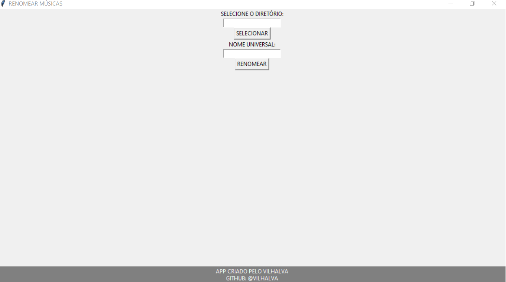

# RENOMEAR MUSICAS
🎈RENOMEIE AS MÚSICAS GLOBALMENTE.

 <br>

## DESCRIÇÃO:
Este projeto permite que você renomeie facilmente arquivos de músicas em um diretório selecionado. Ele adiciona um nome universal seguido de um número sequencial aos nomes dos arquivos, **respeitando a ordem das faixas definida nas tags ID3 (tracknumber)**.

Isso é especialmente útil quando você tem uma pasta com músicas que possuem nomes diferentes e deseja padronizá-los mantendo a ordem correta do álbum — assim como você vê ao classificar por "Faixa" no Windows Explorer.

Por exemplo, suponha que você tenha um diretório com as seguintes músicas (com os metadados de faixa configurados corretamente):

```
1. Song A.mp3 (Faixa 2)
2. Track B.mp3 (Faixa 1)
3. Music C.mp3 (Faixa 3)
```

Após executar o projeto com o nome universal "FAIXA", as músicas seriam renomeadas para:

```
1. FAIXA 01.mp3  ← (Track B)
2. FAIXA 02.mp3  ← (Song A)
3. FAIXA 03.mp3  ← (Music C)
```

Isso garante que todas as músicas:

* Tenham o mesmo nome inicial (ex: "FAIXA");
* Sejam ordenadas corretamente com base na numeração de faixa;
* Sejam facilmente organizadas e identificadas.

## EXECUTANDO O PROJETO:
### 1. INSTALE AS DEPENDÊNCIAS:
Antes de iniciar o aplicativo, é necessário instalar as bibliotecas utilizadas no projeto. No terminal, execute:

```bash
pip install -r requirements.txt
```

> 💡 O arquivo `requirements.txt` está localizado dentro da pasta `./CODIGO`.

### 2. EXECUTE O APLICATIVO:
Acesse o diretório do código e inicie o programa com:

```bash
cd CODIGO
python CODIGO.py
```

### 3. USE O APLICATIVO:
Após a execução, uma janela chamada **"RENOMEAR MÚSICAS"** será exibida. Siga os passos abaixo:

1. Clique em **"SELECIONAR"** para escolher a pasta onde estão suas músicas `.mp3`.

2. No campo **"NOME UNIVERSAL"**, digite o nome base que será usado para renomear todas as músicas (por exemplo, `FAIXA`, `MUSICA`, etc.).

3. Clique em **"RENOMEAR"** para iniciar o processo.

4. O app irá:

   * Ler as tags ID3 das músicas (especificamente a faixa — `tracknumber`);
   * Ordenar os arquivos com base na ordem das faixas;
   * Renomeá-los com o nome universal seguido da numeração sequencial.

5. Quando a renomeação for concluída, será exibida a mensagem:

   ```
   Renomeação concluída!
   ```

## SOBRE O EXECUTAVEL:
### 1. EXECUTANDO:
- Este arquivo executável está disponível apenas para `Windows X64`. Para executá-lo, basta dar dois cliques. O executável é bastante útil caso o Python não esteja instalado. Trata-se da mesma aplicação do arquivo `CODIGO.py`. Se desejar, você pode recompilá-lo novamente; é para isso que forneci o arquivo `imagem.ico`.

### 2. GERANDO:
   **1. Instalação do [PyInstaller:](https://pyinstaller.org/en/stable/)**
   - Certifique-se de ter o PyInstaller instalado. Se não tiver, instale usando o comando abaixo:
   ```bash
   pip install pyinstaller
   ```

   **2. Gerando o Executável:**
   - Para gerar o executável, utilize o comando `pyinstaller` seguido de opções:
      - `--icon="imagem.ico"`: Especifica o ícone do executável.
      - `-w`: Especifica que o executável será do tipo "windowed", ou seja, sem exibir uma janela de console.
      - `-F`: Gera um único arquivo executável em vez de vários.
      - `CODIGO.py`: Substitua "CODIGO.py" pelo nome do seu arquivo Python principal.
   ```bash
   pyinstaller --icon="imagem.ico" -w -F CODIGO.py
   ```

## NÃO SABE?
- Entendemos que para manipular arquivos em muitas linguagens, é necessário possuir conhecimento nessas áreas. Para auxiliar nesse aprendizado, oferecemos cursos gratuitos disponíveis:
* [CURSO DE PYTHON](https://github.com/VILHALVA/CURSO-DE-PYTHON)
* [CURSO DE TKINTER](https://github.com/VILHALVA/CURSO-DE-TKINTER)
* [CURSO DE AUTOMACAO](https://github.com/VILHALVA/CURSO-DE-AUTOMACAO)
* [CONFIRA MAIS CURSOS](https://github.com/VILHALVA?tab=repositories&q=+topic:CURSO)

## CREDITOS:
- [PROJETO CRIADO PELO VILHALVA](https://github.com/VILHALVA)


